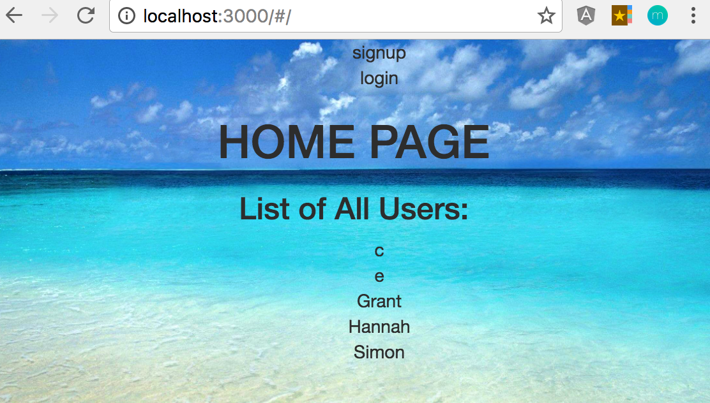
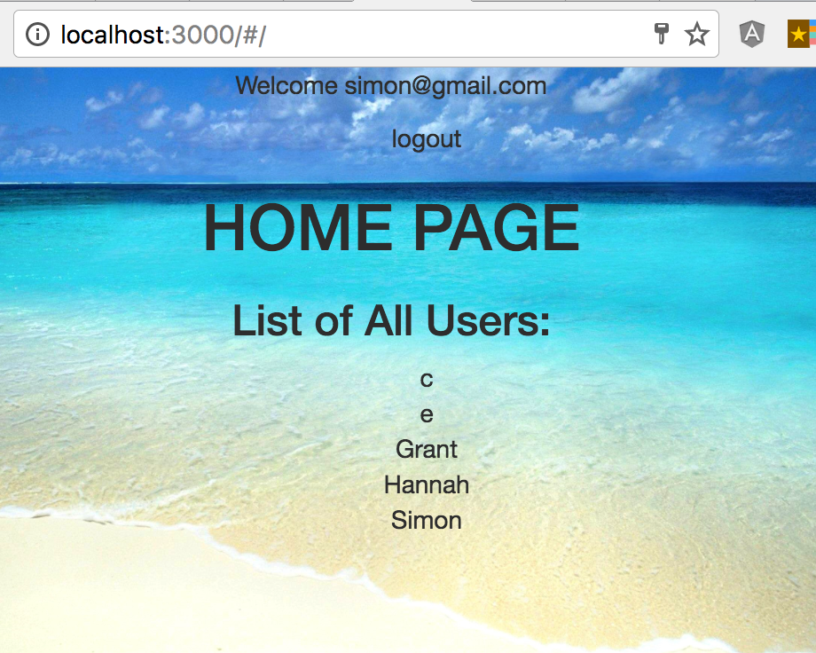
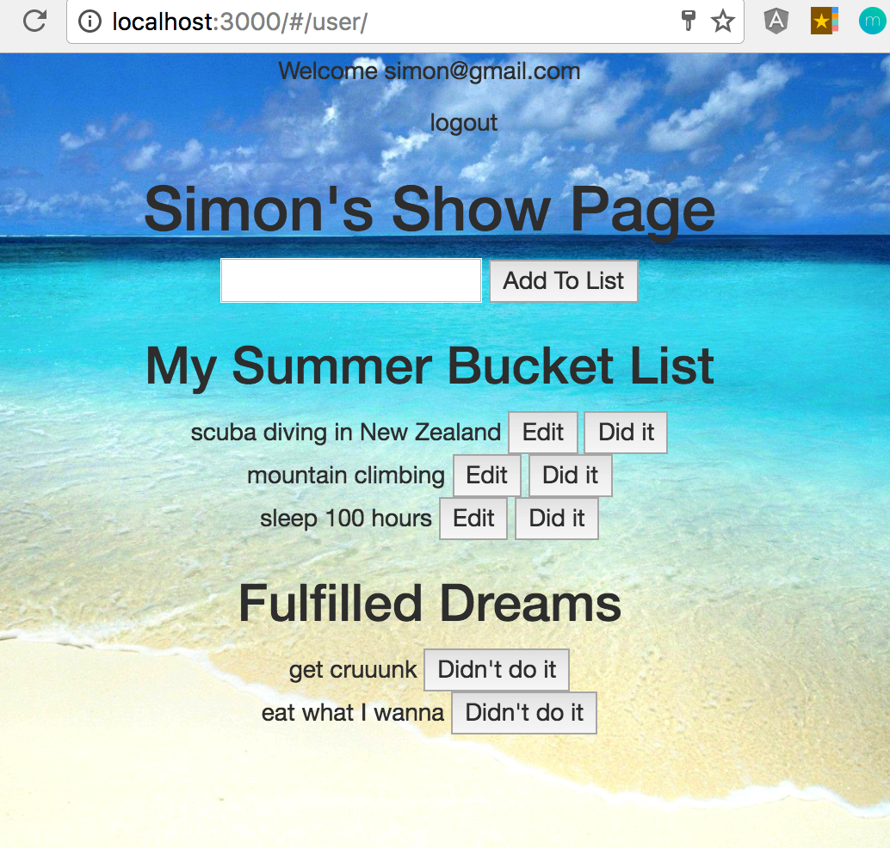
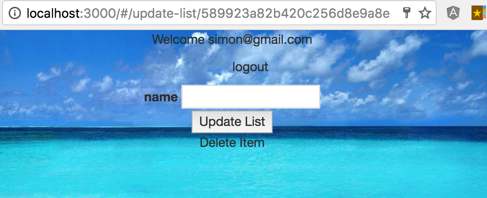

## Summer Bucket List: The Sequel

A long, long time ago.... you built Summer Bucket List 1.0 using Handlebars. Ah, memories..

In tonight's assignment, you'll beef up Summer Bucket List into a lean, MEAN stack app using Angular for our front-end framework.

### Setup :

Your server, models, and Authentication have been set up for you.

You will be writing your code in:

|   |Filename |   Content|  
|---|---|---|---|---|
|  **Server-side Controllers** | `controllers/lists.js`  |  This is where you will write your CRUD routes for the user's list state. |   
|  **Front-end Scripts** |  `public/js/router.js` |  Set up your ui-router here. |
|  |  `public/js/app.js` |  All 3 controllers (Home, Auth, List) are living here. |   
|  |  `public/js/router.js`|  Finish up your ui-router here. |   
|    **Front-end Views**|  `index.html` |  This is the index page. All views will render within `<ui-view></ui-view>` |
|  |  `partials/home.html`|  This is your home page view that lists all users. |  
|  |  `partials/update-list.html`|  This is your edit form for the list. |   
|  |  `partials/user.html`|  This is User show page. |    

### Server-Side: Lists Controller

  - your requirements and module have been set up.
  - set up routes for your `List` resource in here.
  - hint: if you check the `server.js` file, this controller is for requests to : `localhost:3000/users/:id/lists`

### Client-side: App.js

  - The app has been set up for you, including: Home, Auth, and List controllers. You will be writing your CRUD actions for the `list` resource in the `List Controller`.
  - Begin with creating Users and checking they exist in your `mongo` database.
  - Now we need to display the users (maybe through Authentication controller?)

#### Flow of the App (User Stories):

  - When users log in, they see a list of all signed-up users' names. Clicking on a different user doesn't do anything. Clicking on their own name brings them to their show page.
  - In their show page, they can add a new list item. Clicking "Add to List" will display the list item underneath, along with an "EDIT" button.
  - Clicking on the "EDIT" button will take the user to a new view: an edit form for the list, and a delete button. Clicking "UPDATE" will take them back to the show page with the newly edited item. Clicking "DELETE" will take them back to the show page and that item is gone.

### Client-side: Views
  - index.html is set up for you. You will work in the partials files:

|Filename |   Specs|  
|---|---|---|---|
| `partials/home.html`  |  Displays greeting and a list of all users. |   
|  `partials/update-list.html` |  Edit form for "this" list item. You can edit the list's name. |
|  `partials/user.html` |  Display's Username. Displays a form to add new list items. Displays all list items. **Bonus** Displays completed and incomplete list items.  |   

#### Screenshots: View Examples

Home Page (user logged out):

Home Page (user logged in):

User show page:

Edit Form:

### Reach Goals

- Add a "Done" button by each list item. When a user clicks on "Done", it appears in the "Fulfilled Dreams" section with a "Didn't Do It" button.
- Clicking on "Didn't Do It" will remove it from "Fulfilled Dreams" and be placed back in the Bucket List.

## Submitting Your Work

  When you're ready to submit your work,

  1.  Add, commit, and push your code to your fork of the class repo.
  2.  File an issue on the class repo titled "Your Name -- wXXdXX".

  The issue should include:

  -   A link that points back to your fork.

  -   A 'comfort' score on how you feel about the material, from 1 (very
      uncomfortable) to 5 (very comfortable)
